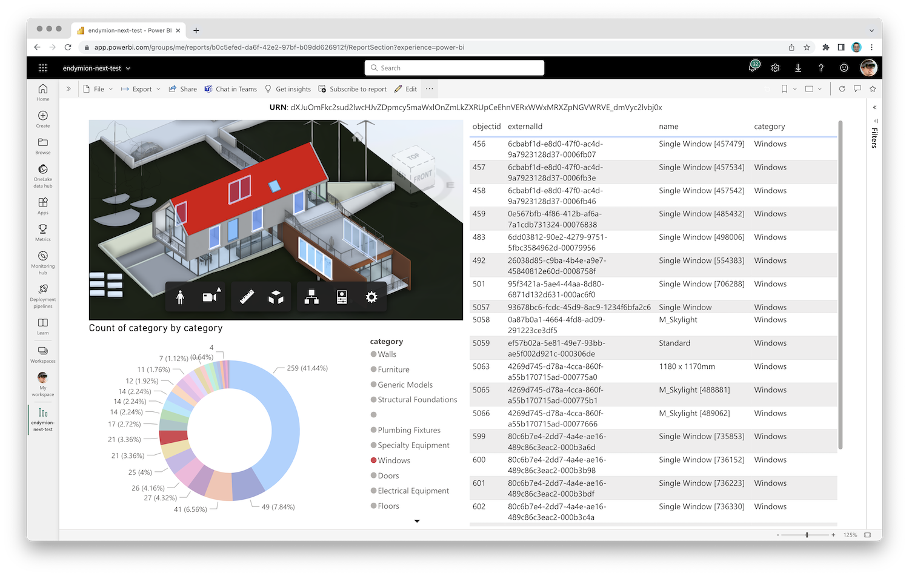

# APS PowerBI Tools

Collection of tools for accessing [Autodesk Platform Services](https://aps.autodesk.com) design data - 2D/3D views as well as element properties - from [Power BI](https://powerbi.com) reports.

There are many different ways in which report authors might want to access design data in APS, for example:

- displaying designs in a viewer - some report authors may want to limit access to specific users only, while others may want the designs to be viewable by everyone
- importing design properties - some report authors may want to access the design properties directly from ACC, while others may already have the data available in a different form (for example, as an [Excel spreadsheet](https://github.com/autodesk-platform-services/aps-extract-spreadsheet))

That is why we provide a collection of custom data connectors, visuals, and supporting web services for _developers_ and _power users_ who can choose just the components that they need, customize them, and use them in their own Power BI reports. For more information, see the README file of each individual component.

## Troubleshooting

Please contact us via https://aps.autodesk.com/get-help.

## License

This sample is licensed under the terms of the [MIT License](http://opensource.org/licenses/MIT). Please see the [LICENSE](LICENSE) file for more details.
