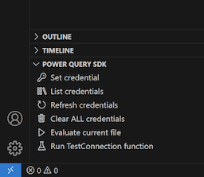

# APS Premium Reporting Connector

Example [custom Power BI data connector](https://learn.microsoft.com/en-us/power-bi/connect-data/desktop-connector-extensibility) for accessing Autodesk product usage data using [Premium Reporting API](https://aps.autodesk.com/developer/overview/premium-reporting-api).

## Usage

[](https://www.youtube.com/watch?v=lVhLbYZpWIY)

## Development

### Prerequisites

- [APS app credentials](https://forge.autodesk.com/en/docs/oauth/v2/tutorials/create-app)
  - [Provision access to ACC or BIM360](https://tutorials.autodesk.io/#provision-access-in-other-products)
- [Power Query SDK](https://learn.microsoft.com/en-us/power-query/install-sdk)
- [.NET 7](https://dotnet.microsoft.com/en-us/download/dotnet/7.0) (in case you want to build the connector manually)

### Testing

- Clone this repository
- Create a _secrets.json_ file in the project folder, and populate it with your APS application client ID and secret:

```json
{
    "APS_CLIENT_ID": "<your client id>",
    "APS_CLIENT_SECRET": "<your client secret>"
}
```

- Open your APS application on https://aps.autodesk.com/myapps, and add the following Callback URL to it: `https://oauth.powerbi.com/views/oauthredirect.html`
- Open the project folder in Visual Studio or Visual Studio Code with the _Power Query SDK_ installed
- Build the connector (*.mez file), either by typing `dotnet build` in the terminal, or by using one of the _Power Query SDK_
actions such as _Evaluate current file_ or _Run TestConnection function_
- Use the _Power Query SDK_ to create new credentials, for example, by clicking the _Set credential_ option in Visual Studio Code



- Open the [PremiumReportingConnector.query.pq](./PremiumReportingConnector.query.pq) file
- Run the test query using  _Power Query SDK_, for example, by clicking the _Evaluate current file_ option in Visual Studio Code

### Publishing

- Build the project using `dotnet build`
- Import the generated *.mez file from the _bin_ subfolder into Power BI Desktop application as explained [here](https://learn.microsoft.com/en-us/power-bi/connect-data/desktop-connector-extensibility#custom-connectors)
- In Power BI Desktop, the custom connector will be available under the name _APS Premium Reporting Connector_

> **IMPORTANT:** the *.mez file should not be shared with 3rd parties as it includes the _secrets.json_ file with your APS application credentials.

## License

This sample is licensed under the terms of the [MIT License](http://opensource.org/licenses/MIT). Please see the [LICENSE](LICENSE) file for more details.
