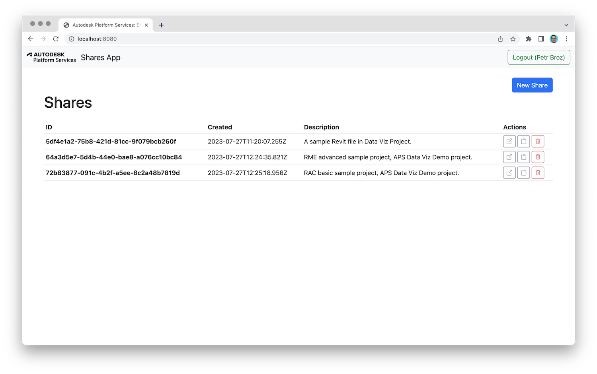

# APS Shares App

Simple web application providing public read-only access to selected designs in [APS](https://aps.autodesk.com)-based applications such as [Autodesk Construction Cloud](https://construction.autodesk.com).

### How does it work?

After logging in with Autodesk credentials, users can create _shares_ for specific designs that they have access to. Each _share_ object provides a publicly accessible link that will always generate a fresh 2-legged token with read-only access to just the URN of the corresponding design. Later, individual _shares_ can be deleted, invalidating their corresponding public links as well.

> The share objects are currently persisted in an [automatically generated OSS bucket](./config.js#L7). The logic for saving and loading shares is implemented in the [./shares.js](./shares.js) file. You can modify this logic to store the shares elsewhere, for example, in a MongoDB database.

## Try it out

You can try a live demo running on this page: https://aps-shares-app.autodesk.io. Log in with your Autodesk credentials, and hit the _New Share_ button. Note that in order for the application to have access to the designs you want to share, you will need to [provision access to your ACC or BIM360 project](https://tutorials.autodesk.io/#provision-access-in-other-products) for it. You'll find the application client ID in the _New Share_ dialog.

Alternatively, you can fork this application on the [replit.com](https://replit.com) website: https://replit.com/@petrbroz1/APS-Shares-App, and provide your own APS application credentials as environment variables. All the required environment variables are listed in the [Running locally](#running-locally) section below.

## Development

### Prerequisites

- [APS app credentials](https://forge.autodesk.com/en/docs/oauth/v2/tutorials/create-app)
  - [Provision access to ACC or BIM360](https://tutorials.autodesk.io/#provision-access-in-other-products)
- [Node.js](https://nodejs.org) (ideally the _Long Term Support_ version)
- Terminal (for example, [Windows Command Prompt](https://en.wikipedia.org/wiki/Cmd.exe) or [macOS Terminal](https://support.apple.com/guide/terminal/welcome/mac))

### Running locally

- Clone this repository
- Install dependencies: `npm install`
- Setup environment variables:
  - `APS_CLIENT_ID` - your APS application client ID
  - `APS_CLIENT_SECRET` - your APS application client secret
  - `APS_CALLBACK_URL` - URL for users to be redirected to after they log in; it should be the origin of your application followed by `/auth/callback`, for example, `http://localhost:8080/auth/callback`
  - `APS_APP_NAME` - your APS application name; it will be displayed in provisioning instructions in the UI
  - `SERVER_SESSION_SECRET` - a random string used to encipher/decipher sensitive data
- Run the server: `npm start`
- Open the browser and navigate to http://localhost:8080

> Tip: when using [Visual Studio Code](https://code.visualstudio.com), you can specify the environment variables listed above in a _.env_ file in the project folder, and run & debug the application directly from the editor.

## FAQ

### How do I specify the design to share?

To keep the application simple and easy to understand (and customize), there is no UI for project browsing and design selection. Instead, users will need to specify the base64-encoded URN of the design to share directly. You can easily retrieve the URN after loading the design into any APS-based application. For example, after opening your design in [Autodesk Construction Cloud](https://construction.autodesk.com), open the browser console and type `NOP_VIEWER.model.getData().urn` to retrieve the URN.

## Troubleshooting

Please contact us via https://aps.autodesk.com/get-help.

## License

This sample is licensed under the terms of the [MIT License](http://opensource.org/licenses/MIT). Please see the [LICENSE](LICENSE) file for more details.
