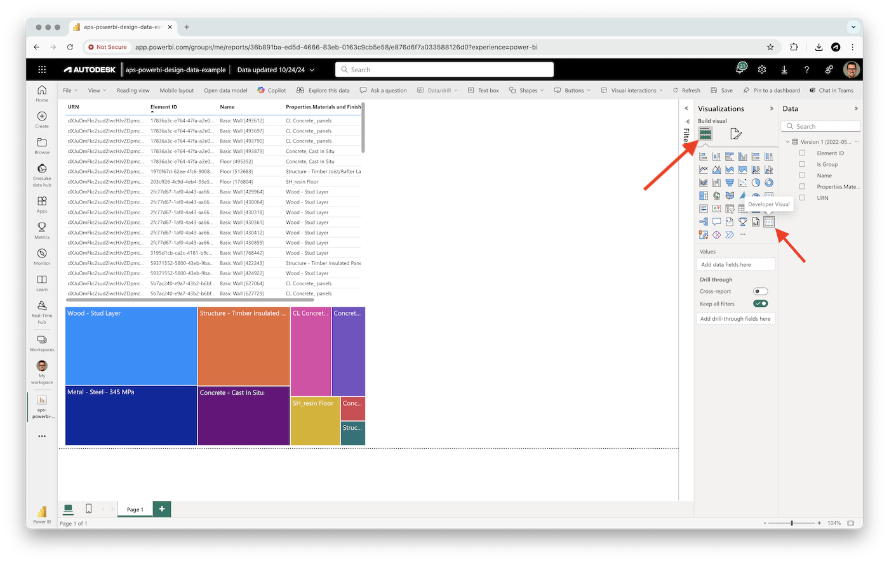
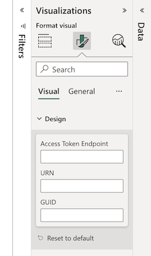

# APS Viewer Visual

[Custom Power BI visual](https://powerbi.microsoft.com/en-us/developers/custom-visualization/) used to display 2D and 3D designs from [Autodesk Platform Services](https://aps.autodesk.com) in Power BI reports.

### How does it work?

This custom visual relies on a separate web service that will be able to generate access tokens for the viewer. The response from the web service should be a JSON with the following structure:

```json
{
    "access_token": <access token string>,
    "token_type": "Bearer",
    "expires_in": <number of seconds in which the token will expire>
}
```

If you don't want to build your own web service, consider using the [APS Shares App](../../services/aps-shares-app/) application that's part of this repository.

## Development

### Prerequisites

- [Set up your environment for developing Power BI visuals](https://learn.microsoft.com/en-us/power-bi/developer/visuals/environment-setup)
- Access to Autodesk Construction Cloud or BIM360 project with existing designs to load into the visual

### Running locally

- Clone this repository
- Install dependencies: `npm install`
- Run the local development server: `npm start`
- Open one of your Power BI reports on https://app.powerbi.com
- Add a _Developer Visual_ from the _Visualizations_ tab to the report



> If you see an error saying "Can't contact visual server", open a new tab in your browser, navigate to https://localhost:8080/assets, and authorize your browser to use this address.

- With the visual selected, switch to the _Formatting_ tab, and enter the _Access Token Endpoint_ and _URN_ of your design (see the _FAQ_ section below for more details about _URN_ and _GUID_ values)



- To enable cross-selection, drag & drop the column of your data containing external IDs into the _External ID_ bucket

### Publish

- Update [pbiviz.json](./pbiviz.json) with your own visual name, description, etc.
- If needed, update the [capabilities.json](./capabilities.json) file, restricting the websites that the visual will have access to (for example, replacing the `[ "*" ]` list under the `"privileges"` section with `[ "https://your-custom-app.com", "https://*.autodesk.com" ]`)
- Build the *.pbiviz file using `npm run package`
- Import the newly created *.pbiviz file from the _dist_ subfolder into your Power BI report

## FAQ

### Where do I find URN/GUID values?

You can retrieve the design URN and viewable GUID after loading the design into any APS-based application. For example, after opening your design in [Autodesk Construction Cloud](https://construction.autodesk.com), open the browser console and type `NOP_VIEWER.model.getData().urn` to retrieve the URN, and `NOP_VIEWER.model.getDocumentNode().guid()` to retrieve the GUID.

## Troubleshooting

Please contact us via https://aps.autodesk.com/get-help.

## License

This sample is licensed under the terms of the [MIT License](http://opensource.org/licenses/MIT). Please see the [LICENSE](LICENSE) file for more details.
