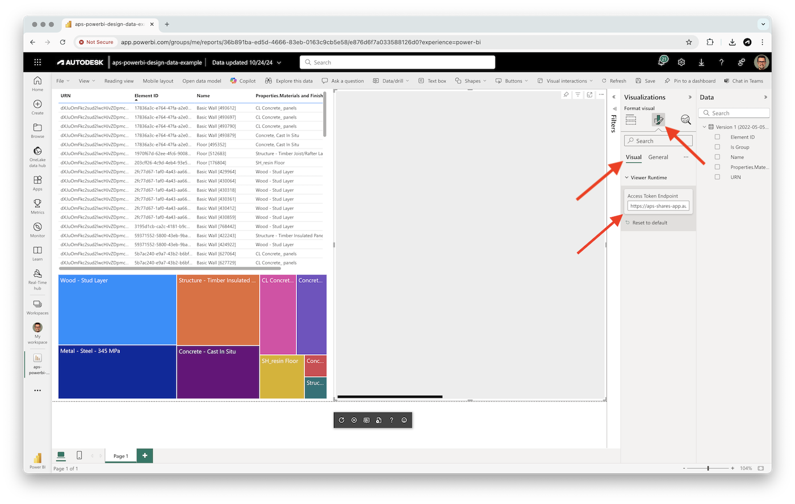

# aps-viewer-visual

[Custom Power BI visual](https://powerbi.microsoft.com/en-us/developers/custom-visualization/), used to display 2D and 3D designs from [Autodesk Platform Services](https://aps.autodesk.com).

## Development

### Prerequisites

- [Set up your environment for developing Power BI visuals](https://learn.microsoft.com/en-us/power-bi/developer/visuals/environment-setup)

**Important:** this custom visual requires some kind of a web service that will be able to generate access tokens for the viewer. If you don't want to build your own, you might want to consider the [aps-shares-app](../../services/aps-shares-app/) application that's part of this repository.

### Setup & run

- Clone this repository
- Install dependencies: `npm install`
- Add the domain of the web application that will be used to generate access tokens for the viewer to the list of allowed domains in [capabilities.json](./capabilities.json) (under the `"privileges"` section)
- Run the local development server: `npm start`
- Open one of your Power BI reports on https://app.powerbi.com
- Add a _Developer Visual_ from the _Visualizations_ tab to the report

> If you see an error saying "Can't contact visual server", open a new tab in your browser, navigate to https://localhost:8080/assets, and authorize your browser to use this address.

- With the visual selected, switch to the _Formatting_ tab, and enter the _Access Token Endpoint_ and _URN_ of your design (see the _FAQ_ section below for more details about _URN_ and _GUID_ values)

### Publish

- Update [pbiviz.json](./pbiviz.json) with your own visual name, description, etc.
- Build the *.pbiviz file using `npm run package`
- Import the newly created *.pbiviz file from the _dist_ subfolder into your Power BI report

## FAQ

### Where do I find the URN/GUID?

You can retrieve the design URN and viewable GUID after loading the design into any APS-based application. For example, after opening the design of your choice in [Autodesk Construction Cloud](https://construction.autodesk.com), open the browser console and type `NOP_VIEWER.model.getData().urn` to retrieve the URN, and `NOP_VIEWER.model.getData().loadOptions.bubbleNode.guid()` to retrieve the GUID.

## Troubleshooting

Please contact us via https://aps.autodesk.com/get-help.

## License

This sample is licensed under the terms of the [MIT License](http://opensource.org/licenses/MIT). Please see the [LICENSE](LICENSE) file for more details.
